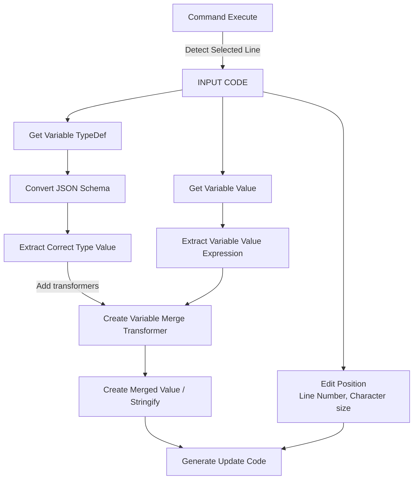

## Development

**Setup**

```bash
$ yarn install
```

**Build Watch**

```bash
$ yarn test --watch
$ yarn watch
```

**Debug Extension**

- `Run Extension` (in vscode)

## Architecture


```mermaid
flowchart TD
A[Command Execute] -->|Detect Selected Line| B[INPUT CODE]

B   --> B10[Get Variable TypeDef]
B10 --> B20[Convert JSON Schema]
B20 --> B30[Extract Correct Type Value]
B30 -->|Add transformers| B32[Transform Code]

B   --> B11[Get Variable Value]
B11 --> B21[Extract Variable Value Expression]
B21 --> B32[Create Variable Merge Transformer]

B   --> B12[Edit Position\nLine Number, Character size]

B32 --> C[Create Merged Value / Stringify]
C   --> D
B12 --> D
D[Generate Update Code]
```
