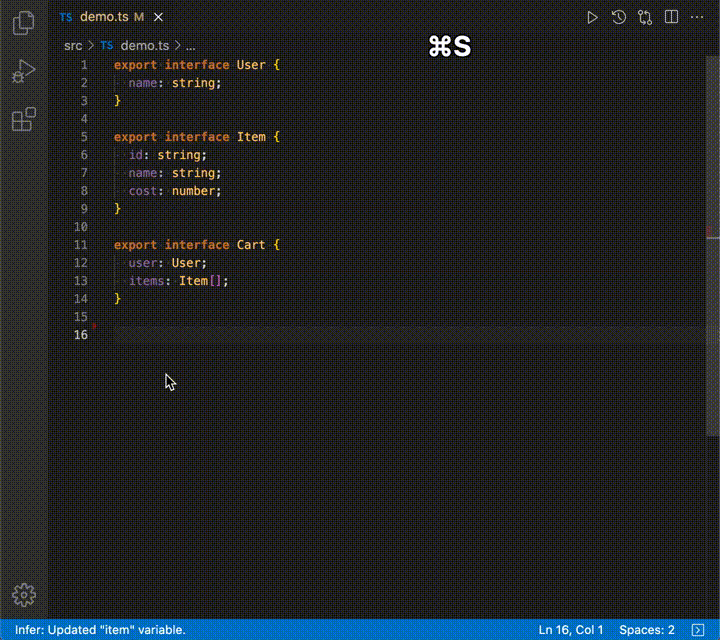

# Generate Inferred Value

- Generating a value from a variable type definition

## Command

| Right Click Menu (Context Menu) | Keybindings (Short Cut) |
| :------------------------------ | :---------------------- |
| `Infer: Generate Value`         | `cmd + shift + i`       |

## Support Language

- [x] `TypeScript`
- [x] `TypeScript React`

## Bug Report

Describe the expected behaviour in your test code and submit a [Pull Request](https://github.com/Himenon/vscode-inferred-value-generator/pulls).

| Bug Type       | Test CodeDirectory                                                                                                                  |
| :------------- | :---------------------------------------------------------------------------------------------------------------------------------- |
| Transform Bugs | [`src/ts-transforms/__tests__`](https://github.com/Himenon/vscode-inferred-value-generator/tree/master/src/ts-transforms/__tests__) |

## Contributions

- [Contributions](./CONTRIBUTIONS.md)

## LICENSE

MIT
